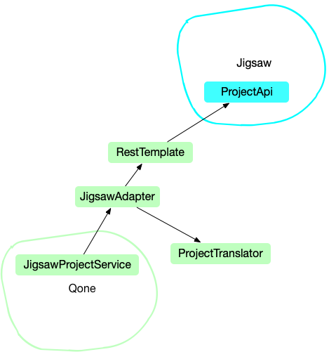

# 《实现领域驱动设计》

----

# 第一章 DDD 入门

## DDD 是什么

DDD 是一种思想，无关系统大小，他是教我们怎样开发好的软件，DDD 并非标新立异之物，而是软件发展的自然结果

其实我们在开发中都不知不觉的使用了一些 DDD 的知识，这些知识是我们在工作中自己摸索出来的，但是大师们在得出知识的基础上还能进行抽象和总结，并以流畅的方式表达出来，让大家都能受益

我们的目标是构建可测试、可伸缩、组织良好的软件

DDD 并不是关于技术的，而是关于讨论、聆听、理解、发现和业务价值的，而这些都是为了将知识集中起来

## 为什么需要 DDD

* 业务专家和开发者一起工作，这样开发出来的软件更准确的传达业务规则，就像代码是业务人员写的一样
* 帮助业务人员更精通业务
* 知识共享，将知识固化到软件中，代码就是设计，设计就是代码
* 统一语言，避免开发人员和业务人员之间的翻译
* DDD 同时提供了战略设计和战术设计两种方式，战略设计让我们确定哪些是重要的，战术设计帮助我们构建 DDD 的各个组件

### 常见的两个症状

贫血对象和失忆症

## 如何 DDD

两大支柱

* 通用语言
* 限界上下文

### 通用语言

`通用语言`是整个团队共享的一套语言，大家对概念的理解是一致的，对于不一致的地方，由于讨论和沟通，最终也要达成一致

大家都用一套语言沟通，就算有人离开也不影响团队的合作

举一个使用`通用语言`开发的例子，护士给病人注射流感疫苗

**第一种** 

```java
patient.setShotType(ShotTypes.TYPE_FLU);
patient.setDose(dose);
patient.setNurse(nurse);
```

**第二种**

```java
patient.giveFluShot();
```

**第三种**

```java
Vaccine vaccine = vaccines.standardAdultFluDose();
nurse.administerFluVaccine(patient, vaccine);
```

显然第三种更清晰，表达意图更准确

#### 如何掌握通用语言

建立术语表，各种术语都列出来，给出明确的定义，大家都按这个定义来沟通

### 限界上下文

一套`通用语言`是使用在一个`限界上下文`中的，不同`限界上下文`中同一个术语意义可能不同，这时需要进行`限界上下文`的映射，`限界上下文`的内容在下一章

## DDD 的业务价值

1. 获得了一个给常有用的领域模型（把精力花在有价值的东西上）
2. 对业务有了更准确的定义和理解
3. 领域专家可以为软件设计做出贡献
4. 更好的用户体验（对领域理解越深，设计出的软件往往更易于使用）
5. 清晰的边界模型，利于将技术资源集中在交付价值上
6. 更好的企业架构，通过对`限界上下文`的划分，更好的理解了企业的业务内容
7. 敏捷、迭代式和持续建模
8. 使用战术和战略新工具

## 实施 DDD 所面临的挑战

当我们对一个领域进行建模时，我们需要仔细考虑对象做什么事情，这是关于对象行为设计的。我们希望对象行为的命名能够传达准确的业务含义，也即反应`通用语言`。要达到这样的目的，显然不是定义属性和 getter、setter 这么简单的事情

DDD 可以和测试驱动开发配合的很好，开发之前，先写测试代码，此时测试代码模拟客户代码对模型的使用方式，测试代码驱动着模型的设计，在模型编写之后，添加更多的测试，此时关注的是领域对象的表达力，测试代码便是`通用语言`在程序中的表达

# 第二章 领域、子域和限界上下文

广义上讲，`领域`即是一个组织所做的事情以及其中包含的一切

一个`领域`被分成若干`子域`，`子域`又有三种类型

* 核心子域
* 支撑子域
* 通用子域

我们的关注点要从`核心域`出发

理想情况是一个`限界上下文`与一个子域对应，一个`限界上下文`中的一个概念是不会有多种意义的

实际情况中，很多垃圾软件的存在是一个事实，所以，以上的理想情况通常达不到，你需要和已有的软件系统进行集成

`限界上下文`主要是一个语义上的边界，我们应该通过这一点来衡量对一个`限界上下文`的使用正确与否

当需要集成时，我们必须在不同的`限界上下文`之间进行概念映射

我们需要识别出那些区别微小的概念，看看是否在不同的`限界上下文`中进行了分离

`限界上下文`也不是一成不变的，在每一个迭代中，我们对要对之前的假设提出挑战，看看需要修改哪些概念，加入哪些概念，删除哪些概念

`限界上下文`的建模应该是从`通用语言`的角度进行思考，而不是为了满足架构组件或者开发资源进行考虑

# 第三章 上下文映射图

`上下文映射图`主要帮助我们从解决方案空间的角度看问题

`上下文映射图`反应的是项目当前的状态，随着项目的研究，`上下文映射图`也会随之更改

两个`限界上下文`有哪些关系？

* 合作关系（一起成功，一起失败）
* 共享内核（内核尽量小）
* 客户方-供应方
* 遵奉者
* 防腐层
* 开放主机服务
* 发布语言
* 另谋他路
* 大泥球

通常来说，一个外部的概念需要翻译才能够进入当前的`限界上下文`

我也根据图中的实例画了自己系统中一个简单的`上下文映射图`



> 此图采用 Omni Graffle 所画，也算与本季度的第二个目标进行了关联

# 第四章 架构

* 风险驱动架构
* 用例驱动架构

不同的架构风格

## 分层

严格分层架构和松散分层架构

本章的介绍几乎提到了后文讲到的所有概念，在这里可以有一个总体的了解，第一遍可能不会全懂，需要看完后面之后回来再读一下

### 六边形架构（端口与适配器）

将分层架构摊平了，核心是`领域模型`，外层是`应用程序`，最外层是端口和适配器，所有输入输出都通过端口和适配器进行处理

`资源库`可以看作是持久化适配器

六边形架构的一大好处在于，我们可以轻易的开发用于测试的适配器，整个应用程序和领域模型可以在没有客户和存储机制的条件下进行开发

### 面向服务的架构

1. 业务价值高于技术策略
2. 战略目标高于项目利益

技术组件对于划分模型来说并没有那么重要，用例和功能才是驱动架构的根本

# 其他资料

* [《实现领域驱动设计》阅读日志](../reading_record/《实现领域驱动设计》阅读日志.md)
