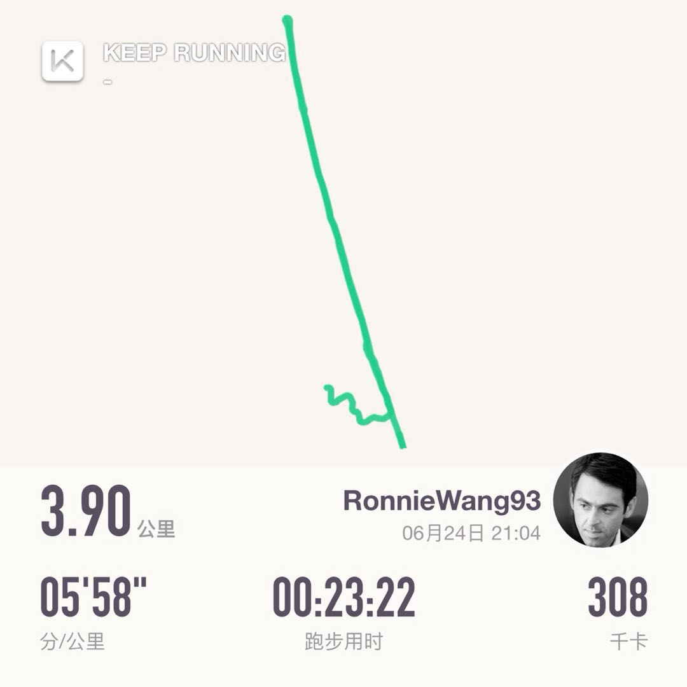
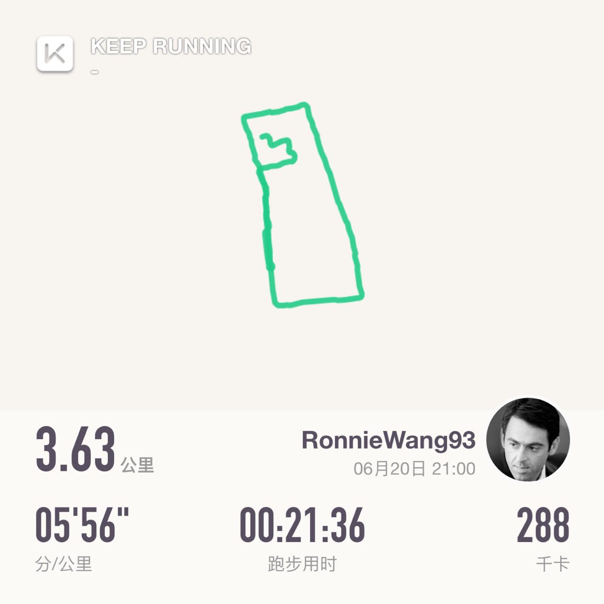
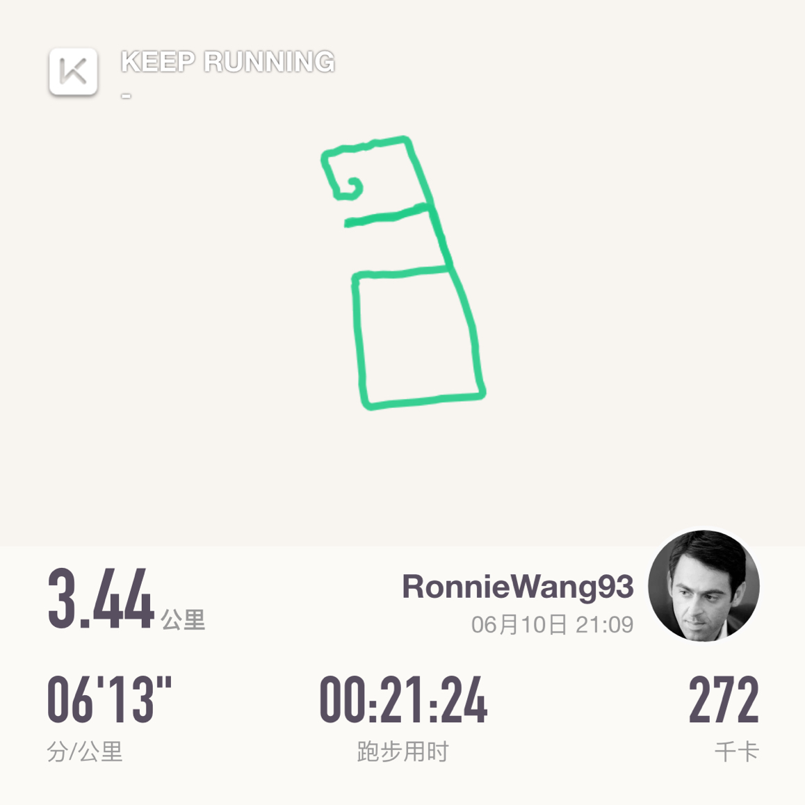
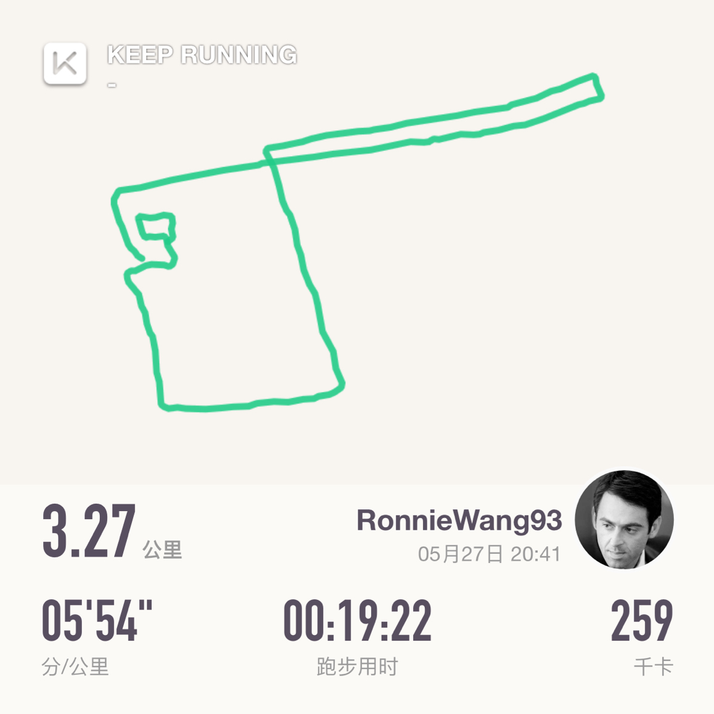
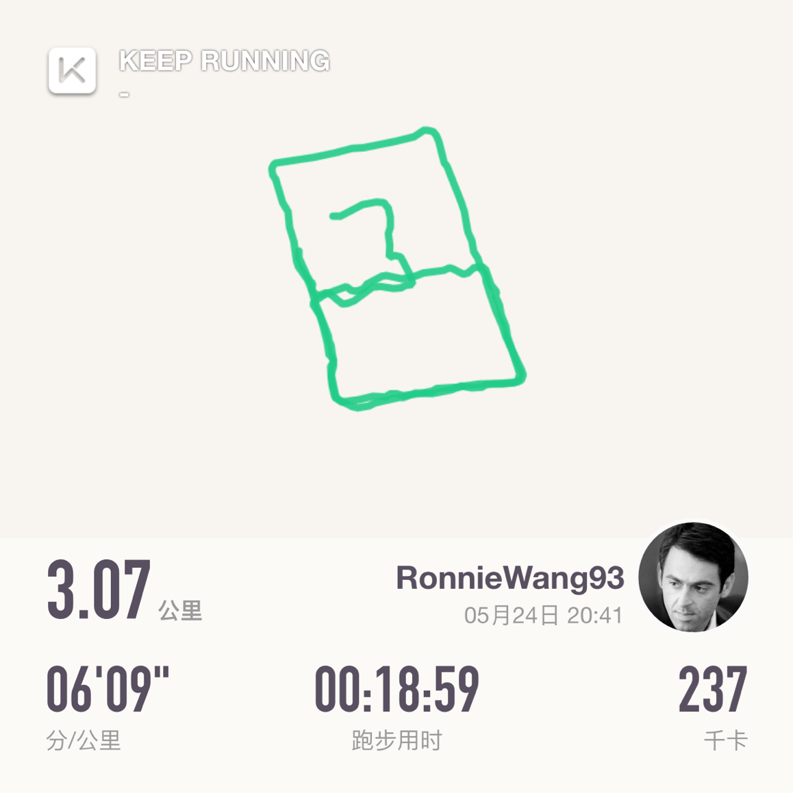

# 跑下 5km

## 概述

### 原则

* 以第一次尽力跑步为起始距离
* 之后每次必须超越上次距离，当超过上次距离时，开始加速跑，跑至少一百米
* 保证每周至少跑一次

### 阶段目标一

* 跑到5公里

### 阶段目标二

* 5公里跑进30分钟

### 阶段目标三

* 5公里跑进28分钟

### 终极目标

* 5公里跑进25分钟，到此为止吧，根据90定律，应该能超过百分之90的人了😄

## 目标完成情况

### 2019-06-24 3.90km

### 2019-06-20 3.63km

### 2019-06-10 3.44km

### 2019-05-27 3.27km

### 2019-05-24 3.07km

